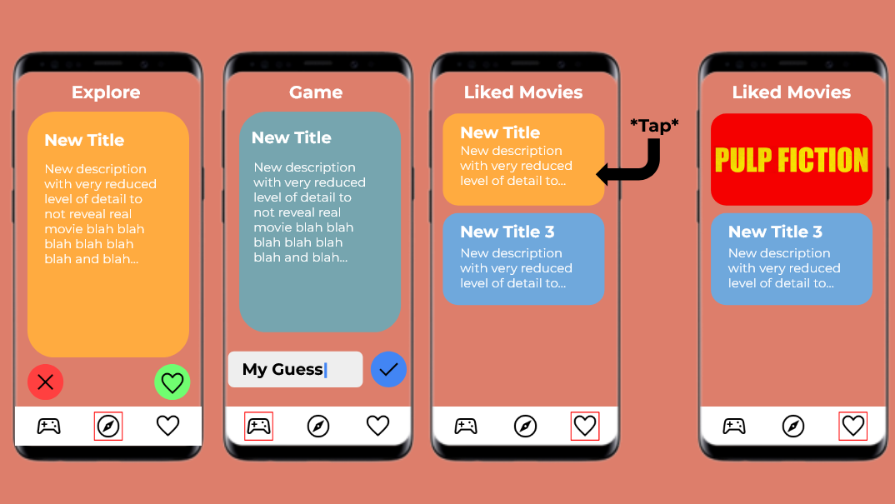

## Final App Chosen: Media App
# Milestone 1 - CinemaUp

## Table of Contents

1. [Overview](#Overview)
1. [Product Spec](#Product-Spec)
1. [Wireframes](#Wireframes)
1. [Sprint 1](#Sprint-1)

## Overview

### Description

An app that allows the users to track upcoming movies, see the top 10 currently playing movies, and get recommendations of movies with a not revealing description, that leads user to watch it based on a intriguing overview. Additionally the app will include a guessing game using the generated random description so users can guess from what movie it is from.

### App Evaluation

 - **Description:** An app that allows the users to track upcoming movies, see the top 10 currently playing movies, and get recommendations of movies with a not revealing description, that leads user to watch it based on a intriguing overview. 
  - **Category:** Entertainment
  - **Mobile:** Not essential for mobile but having this app be a mobile allows easier access for users 
  - **Story:** Letterbox with a social media and game aspect. Allows users to follow their friends, keep up with pop culture, and be informed about the most popular movies playing.
  - **Market:** Any user that is interested in learning more about the movie industry and wants to learn more about the technicalities that go into movie production
  - **Habit:** Users are prompted daily for a movie guessing game based on the movies description. A streak type system is implemented daily to entice users to revisit the app. 
  - **Scope:** V1 would incorporate movie information such as upcoming movies, top 10 playing now, movie description guessing game, and current box office and movie reviews through Rotten Tomatoes. V2 would incorporate more features such as "movie released today in history", movie guessing with pixelated poster, and current top 10 TV shows. V3 would include further aspect of social media such as followers, review likes, and comments on reviews.
  

## Product Spec

### 1. User Features (Required and Optional)

**Required Features**

* User authentication
    * Email and password
* Movie categories interests
* Movie guessing game
* Movie reviews through Rotten Tomatoes
* Current box office information
* Trending movie list
* Liked movies

**Stretch Features**
* Favorite movies
* Advance search filters
* Social media sharing
* Post commment to movie reviews
* Watchlist and movie reminders
* Followers
* Streak system to engage users to revisit the app

### 2. Screen Archetypes

* Login Screen
    * User can login
* Registration Screen
    * User can create a new account
* Stream
    * User can view a feed of movie recommendations
    * User can view a feed of movie guessing game recommendations
    * User press a button to like a movie
* Search
    * User can search for a movie
    * User can search movies with filters
* Guess game Screen
    * User can play to guess a movie title
    * User can skip to the next movie
* Account Screen
    * User can view account information
    * User can log out
    * User can change movie interests
    
    

### 3. Navigation

**Tab Navigation** (Tab to Screen)

* Explore
* Game
* Likes

**Flow Navigation** (Screen to Screen)

- Login Screen
    => Explore Screen 
- Registration Screen
    => Explore Screen
- Explore
    => Search Screen
- Likes
    =>Account
- Account
    => Login

## Wireframes

## Sprint 1
- [X] User Authentication Page
- [X] Now Playing Movies Horizontal Recycler View
- [X] Navigation Bar
- [X] Detailed Movie with Intents
- [X] Sprint 2 Issues Assigned [Sprint 2](https://github.com/Team8-Codepath/FinalProject/milestones)

